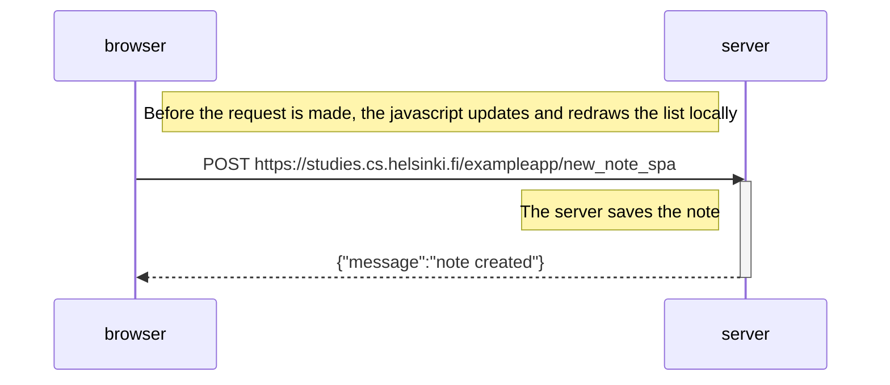

```mermaid
sequenceDiagram
    participant browser
    participant server

    Note right of browser: Before the request is made, the javascript updates and redraws the list locally

    browser->>server: POST https://studies.cs.helsinki.fi/exampleapp/new_note_spa
    activate server
    Note left of server: The server saves the note
    server-->>browser: {"message":"note created"}
    deactivate server
```
